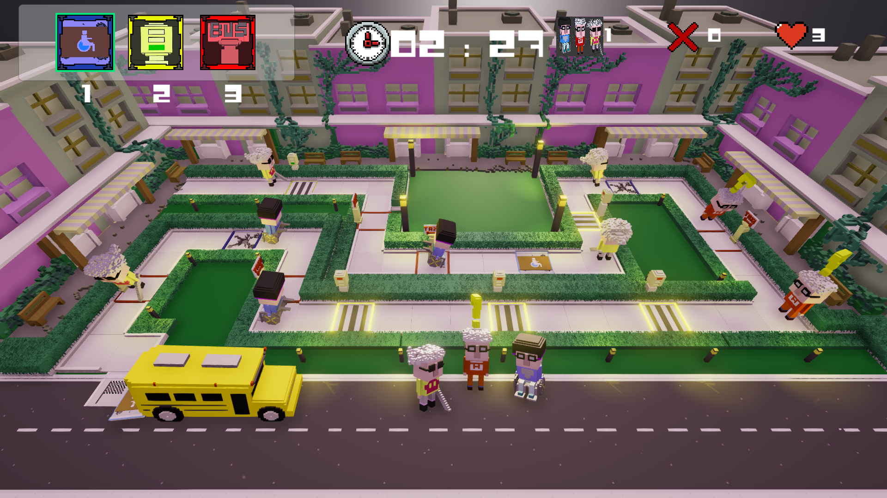

# Software engineer

Software engineer, always interested in learning new skills and experimenting with new technologies. With a particular interest in the game development field.

## Education

- Master's degree in computer graphics, games and virtual reality. Universidad Rey Juan Carlos (2018)
- Computer Science degree. Universidad Carlos III de Madrid (2016)

## Work Experience 

### Research engineer at SEDDI (02-2018, 05-2024)

Focused on the research and implementation of several systems to obtain and process parametric avatars from different types of inputs.

- Avatar from video: development of a pipeline to obtain an SMPL parametric avatar to fit a target point cloud obtained from a video by using: structure from motion, 3D post-processing and non-linear optimization of the avatar’s pose and shape parameters.
- Avatar from measurements: development of a system to obtain an SMPL parametric avatar with a 3D body to match a set of target measurement values.
- Implementation of the required tools to aid with the development, testing, analysis and research of the avatars’ technology.

Used Python, PyTorch, Blender, Git, Pandas, COLMAP, Tkinter, Polyscope.

#### Publications 

Tasked with the avatar reconstructions for the publications below:
- https://emebassey.medium.com/online-fashion-shopping-through-the-lens-of-body-perception-f63594eb0de (2023)
- https://www.truetoform.fit/post/how-brands-can-use-technology-to-enter-the-sustainability-movement (2023)
- De Coster, L., Sánchez-Herrero, P., López-Moreno, J., & Tajadura-Jiménez, A. (2021). The Perceived Match Between Observed and Own Bodies, but Not Its Accuracy, Is Influenced by Movement Dynamics and Clothing Cues. Frontiers in Human Neuroscience, 430.
- De Coster, L., Sánchez-Herrero, P., López-Moreno, J., & Tajadura-Jiménez, A. (2021). Use of a real-life practical context changes the relationship between implicit body representations and real body measurements. Scientific reports, 11(1), 1-15.
- De Coster, L., Sánchez-Herrero, P., Aliaga, C., Otaduy, M. A., López-Moreno, J., & Tajadura-Jiménez, A. (2020). perceived match between own and observed models’ bodies: influence of face, viewpoints, and body size. Scientific reports, 10(1), 1-18.

## Proyects
### Small game engine (In progress)

Small implementation of a game engine in my free time. 

[Thule engine repository](https://gitlab.com/pablosherrerog/thule_engine)

There are some topics that I'm interested in learning, so the idea is to have a project that I can use to apply the things while I learn them. 
- I wanted to understand better C++ and the overall architecture of a Game Engine, including automatizing the build and testing steps (CI/CD).
    - To learn more about the general structure of Game Engines I'm reading the book [Game Engine Architecture](https://www.gameenginebook.com/) (Jason Gregory).
    - I'm also using the channel [The Cherno](https://www.youtube.com/@TheCherno) as it covers many interesting topics like how to implement a GUI using ImGui, managing an asset manager, etc...
- I was interested in learning more about the ECS approach so I used [Austin Morlan introduction to ECS](https://austinmorlan.com/posts/entity_component_system/#demo).
- I would like in the future to learn more about Vulkan or DirectX but for now I'm using OpenGL since it's more approachable
  - Using [learnopengl](https://learnopengl.com/) as the main resource.
- I wanted to try a tool to profile the code and understand better why some parts of the code were taking too much time so I integrated the [Tracy Profiler](https://github.com/wolfpld/tracy). 

### Game Jam UPM (2019)

IV Edition UPM Game Jam. 48h to develop a game, the team was composed of 4 people. The theme was disabled people. 

Geriatric Hard Road: Help the elderly get to the bus by fixing the obstacles in their way. But be careful not to waste resources on unnecessary renovations or you will receive a penalty.

[Geriatric Hard Road itch.io](https://irx99.itch.io/geriatric-hard-road)

Used: Unity.

### Master thesis (2018). Parametric avatar reconstruction using point clouds

Used linear blend skinning and principal component analysis to create a custom parametric avatar with pose and body shape parameters. Used non-linear optimization with the avatar’s parameters to deform the avatar’s mesh to fit a target point cloud.

Used: C++, OpenGL, Blender, Ceres, COLMAP.

### Master's Gaming technology project (2017).

Final project for the Gaming technology subject. The goal was to make a videogame from start to finish.

Summary: local split-screen multiplayer for 4 players. They must fight in an arena, the one who scores more points by eliminating the other players wins the game. There are several powers in the map that can be combined in different ways to achieve different combos (for example the freezing power and magnetic sphere is a good combination to submerge your opponent into the water). The arena will add an extra challenge by dropping the floor tiles into the water and throwing some nasty events to the players (for example a giant spike ball or a rainfall of mines).

[Robot wars gameplay video](https://youtu.be/F05E09HXF68)

Used: Unity, Blender.

### Bachelor thesis (2016) Computer vision integrated with virtual reality devices applied to videogames. 

Used an Oculus headset (DK1) and computer vision using a Kinect camera (V1) to create a VR experience. I learned about virtual reality devices, positional tracking systems, computer vision, and Unity

[LightSaber game with Unity, Kinect, OpenNI2, OpenCV, Oculus Rift DK1 and a pool noodle video](https://www.youtube.com/watch?v=pCz_zCBTLQw)

Used C++, Unity, Kinect, Blender and OpenCV.
